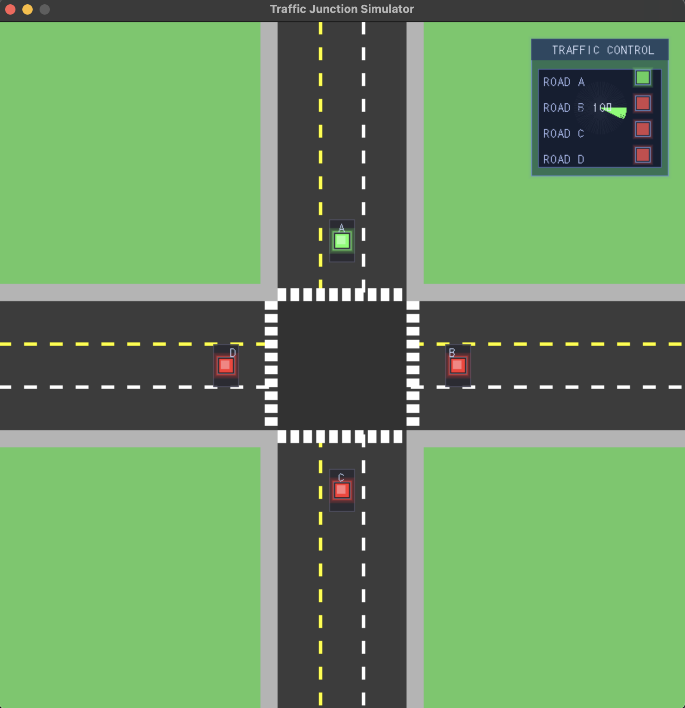

# Traffic Junction Simulator 🚦

A DSA project implementing a queue-based traffic management system for a four-way intersection with priority lanes and free-turning lanes.

<div align="center">
  
  <br><br>
  
</div>

## Overview
## Key Features

- **Queue-based Traffic Management**: Using linear data structures to solve a real-world problem
- **Multiple Lane Types**:
  - **Regular Lanes (L2)**: Served based on traffic light signals, can go straight or turn right
  - **Priority Lane (A2)**: Gets precedence when it has >10 vehicles, until count drops <5
  - **Free Lanes (L3)**: Always allowed to turn left regardless of traffic light state
  - **Incoming Lanes (L1)**: Vehicles arrive here from other roads
- **Dynamic Traffic Light Timing**: Light duration calculated based on waiting vehicle count
- **Realistic Vehicle Movement**: Proper queueing and turning animation
- **Multi-lane Intersection**: Handles 3-lane roads in a four-way intersection

## Implementation Details

### Data Structures
- **Basic Queue**: FIFO queue for vehicles in each lane
- **Priority Queue**: Used for lane management with priority values

### Algorithms
- **Traffic Light Calculation**: Total time = |V| * t where:
  - |V| = Average vehicles waiting = (1/n) * Σ|Li|
  - n = Number of normal lanes
  - t = Time per vehicle (2 seconds)
- **Priority Scheduling**: When Lane A2 exceeds 10 vehicles, it receives highest priority
- **Free Lane Routing**: Lane 3 vehicles can always turn left regardless of traffic light state


## System Architecture

The system consists of two main components:

1. **Vehicle Generator**:
   - Continuously generates vehicle data with unique IDs
   - Assigns entry lanes, exit lanes, directions, and states
   - Writes data to files (e.g., `AL2.txt`)

2. **Traffic Simulator**:
   - Reads vehicle data from generated files
   - Processes vehicles through the intersection based on traffic rules
   - Updates vehicle states and visualizes the simulation using SDL3

### Lane Movement Rules
- **L3 lanes** always go to their left lanes:
  - AL1 → BL3
  - BL3 → CL1
  - CL1 → DL3
  - DL3 → AL1
- **L2 lanes** can either go straight or turn right:
  - AL2 → CL1 or DL1
  - BL2 → AL1 or DL1
  - CL2 → AL2 or BL1

## Prerequisites
- C++17 compatible compiler (GCC 8+, Clang 7+, MSVC 19.14+)


## Building and Running the Project

### Installing SDL3
SDL3 is still in development and may not be available in standard package managers. You'll need to build it from source:

#### Linux
```bash
# Install development tools
sudo apt-get update
sudo apt-get install build-essential git cmake

# Clone SDL3
git clone https://github.com/libsdl-org/SDL.git -b SDL3
cd SDL

# Build and install
mkdir build && cd build
cmake .. -DCMAKE_BUILD_TYPE=Release
make -j$(nproc)
sudo make install
```

#### macOS
```bash
# Using Homebrew
brew install cmake git

# Clone SDL3
git clone https://github.com/libsdl-org/SDL.git -b SDL3
cd SDL

# Build and install
mkdir build && cd build
cmake .. -DCMAKE_BUILD_TYPE=Release
make -j$(sysctl -n hw.ncpu)
sudo make install
```

#### Windows
```bash
# Clone SDL3
git clone https://github.com/libsdl-org/SDL.git
cd SDL

# Build with Visual Studio
mkdir build && cd build
cmake .. -DCMAKE_BUILD_TYPE=Release -G "Visual Studio 17 2022" -A x64
cmake --build . --config Release

# Install (run as administrator)
cmake --install . --config Release
```

### Building the Application

#### Linux/macOS
```bash
# Clone the repository
git clone https://github.com/nischal0x01/dsa-queue-simulator.git
cd dsa-queue-simulator

# Create build directory
mkdir build && cd build

# Configure and build
cmake ..
make -j$(nproc)
```

#### Windows
```bash
# Clone the repository
git clone https://github.com/nischal0x01/dsa-queue-simulator.git
cd dsa-queue-simulator

# Create build directory
mkdir build && cd build

# Configure and build with Visual Studio
cmake .. -G "Visual Studio 17 2022" -A x64
cmake --build . --config Release
```

### Running the Simulation

1. Open two terminal windows
2. In the first terminal, run the traffic generator:
   ```bash
   # Linux/macOS
   ./bin/traffic_generator

   # Windows
   .\bin\Release\traffic_generator.exe
   ```
3. In the second terminal, run the simulator:
   ```bash
   # Linux/macOS
   ./bin/simulator

   # Windows
   .\bin\Release\simulator.exe
   ```

---